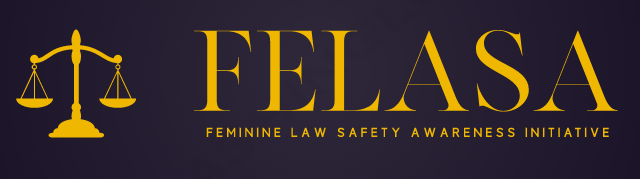

# Felasa Initiative

## About Us:
 
Felasa, or The Feminine Law Safety Awareness Initiative, founded in August 2022, is a forum to create awareness about women’s safety laws in India. Our vision entails legally empowering women (both educated and illiterate) ignorant of their rights to access and demand justice.

* We are mainly dedicated to providing a platform to connect women with low access to financial resources to pro-bono lawyers and NGOs.
* Acknowledging the amount of resources required to build cases which limit the number of women that could be helped, we utilize technology to highlight victims of gender-based crimes. Our algorithm summarizes the information from disparate articles in the media to help lawyers build their cases.
* Through blogs and outreach programs, we are also committed to sensitizing women and girls about their safety rights and laws established under the Constitution of India.

## Why the need to create women's safety law awareness?

Being conscious and up to date about your rights allows an individual to alter their life and fight against any injustice coming their way through judicial protection. Without proper awareness, the promulgation of laws established to protect women in society will not be effective and social evils will continue to derail the lives of countless women.

Dowry was abolished in 1961 with the passing of the Dowry Prohibition Act. This prohibited the practice of accepting and giving dowry, which was a punishable offence by law if found guilty. However, India still reports an alarming trend of dowry death, according to which 20 women die every day due to dowry-related harassment. While many factors contribute to this, a lack of awareness of rights deprives them of their chance to fight for themselves and seek judicial protection through the legislation in place.

As a start to bring about change, more women and girls need to take the initiative to educate themselves about their judicial rights. Additionally, they must comprehend what behaviours are recognized as criminal offences. Legal empowerment of women will provide them with the confidence to tackle the obstacles life throws their way and seek justice for the crimes against them. Thus, recognizing this quintessential need, we as an organization strive to create awareness and sensitize women about their rights and laws.

## The Founders:

* [Supriti Vijay](https://supritivijay.github.io/)

* [Aman Priyanshu](https://amanpriyanshu.github.io/)

* [Shreyans Mehta](https://www.linkedin.com/in/shreyans-mehta-01/)

* [Mudit Sinha](https://www.linkedin.com/in/muditsinha01/)
